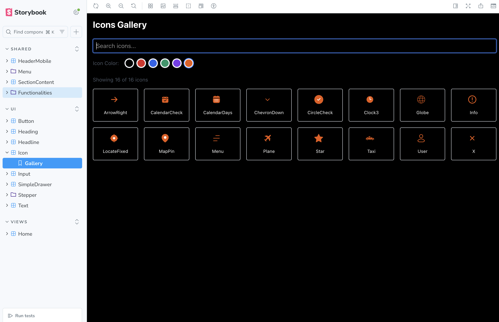

# Install & Get started:
  - install SF PRO font
  - SF PRO font is located at /documents/SF-Pro.dmg
  reference: https://developer-apple-com.translate.goog/fonts/?_x_tr_sl=en&_x_tr_tl=vi&_x_tr_hl=vi&_x_tr_pto=tc

```terminal
  yarn install
  yarn build
  npm install -g serve
  serve -s dist
```

# Development

Run dev

```terminal
yarn dev
```
## Structure folder

```text
structure:

src
|__ components
    |__ shared
    |   |__ component A  
            |__ components
            |   |__ ChildOfA
            |   |__ ChildOfB
            |__ ComponentA
    |   |__ component B
    |__ ui
        |__ component C
        |__ component D
```

/src/ui: small, primitive components
/src/shared: bigger and composable components which can be created by using components inside /src/ui

For each parent component, we can create _components_ directory to include children components

## Storybook

Run storybook:

```terminal
yarn storybook
```

Storybook is tool to list all components. We break each big component into smaller components and so on. Most components should be defined into Storybook. Styling of components can be changed whether they are in desktop or mobile. It 's recommended to define Mobile and Desktop versions. The advantages is as It helps verifying components by perfect pixel easier. For example:

```tsx
import type { Meta, StoryObj } from '@storybook/react'
import LocateCard from './locate-card'

const meta = {
    title: 'Shared/Functionalities/SectionSchedule/components/LocateCard',
    component: LocateCard,
    parameters: {},
    argTypes: {},
    args: {},
} satisfies Meta<typeof LocateCard>

export default meta
type Story = StoryObj<typeof meta>

export const Mobile: Story = {
    globals: {
        viewport: 'mobile', // set mobile screen
    },
    args: {},
}

export const Desktop: Story = {
    globals: {
        viewport: 'desktop', // set desktop screen
    },
    args: {},
}
// These viewport can be defined in .storybook/preview.ts
```

Last thing, We can document for components at the Storybook such as How to use a component, some notice, etc.

# Build

```markdown
yarn build
```

# Serve

After build is done we got `dist` folder, We cen serve from that folder by running:

```terminal
npm install -g serve
serve -s dist

```


# Q & A
1. How to Update Icons
- step 0: get svg of an icon on Figma then convert it to React component by a tool like [svg-to-react-jsx](https://www.svgviewer.dev/svg-to-react-jsx)
- step 1: Create Icon component. For example open src/components/ui/icon/Menu.tsx to see structure
  Make sure to edit color if any. It's often as replacing a fixed color to `"currentColor"`
- step 2: Run script: `yarn generate-icons`
    Above command will update content inside:
      - src/components/ui/icon/index.ts
      - src/components/ui/icon/icons.stories.tsx
  step 3: Verify it at Storybook

2. How to Looking for an icon?

Open Storybook. Select UI/Icon/Gallery


